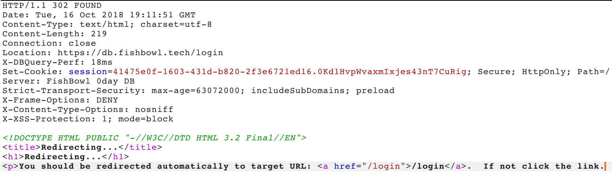
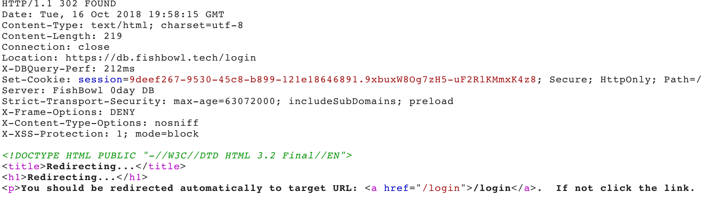
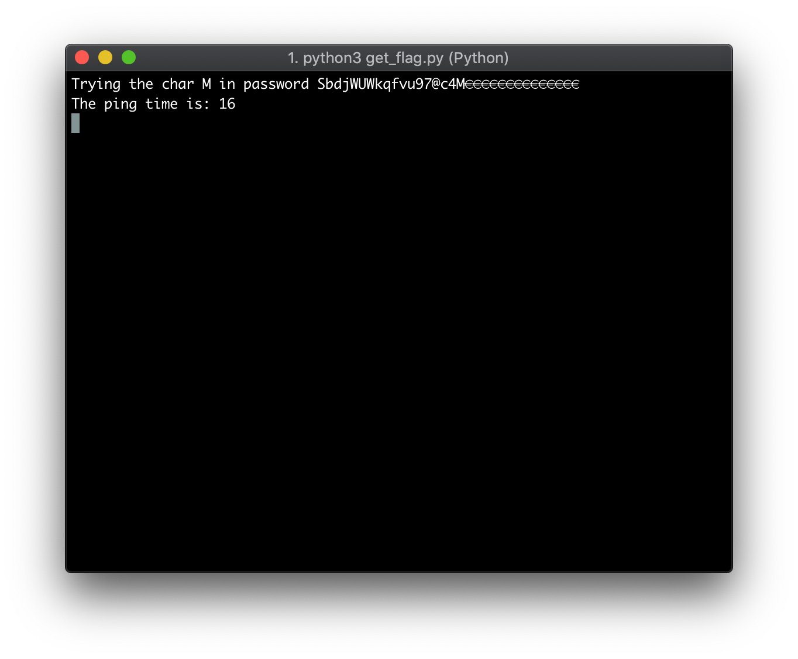
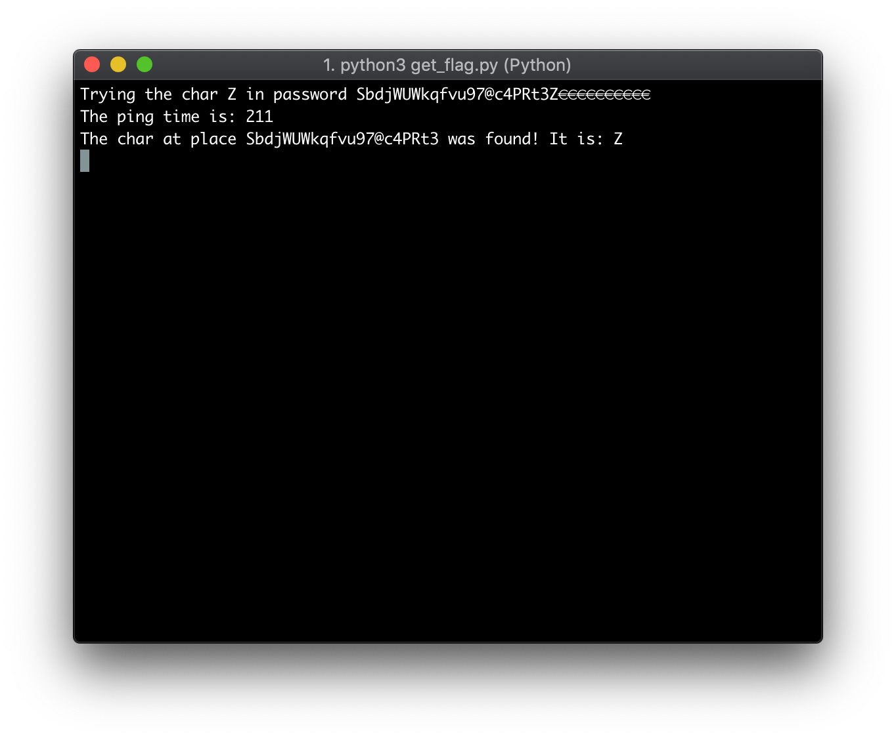
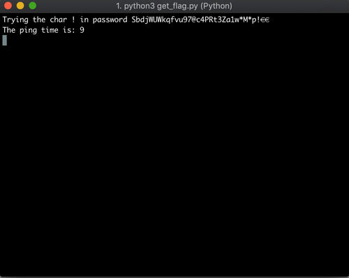

# Access Denied

> During his development on the custom DBMS and secret investigations, our insider intern figured that the performance issues might have some security impact on the web interfaces authentication as well. Since said entity is rather sloppy with their access controls we found an internet facing web interface. Go over to [db.f••••••l.tech](https://db.fishbowl.tech/) and see if you can gain access to the application.

## Table of Contents

1. [Information Gathering](#information-gathering)
2. [Login Analysis](#login-analysis)
3. [Examining POST Response Headers](#examining-post-response-headers)
4. [Writing The Exploit](#writing-the-exploit)
5. [TL;DR](#tldr)

## Information Gathering

In the beginning we were given a [GIF](images/nope.gif) file and a [URL](https://db.fishbowl.tech/). Investigating the GIF file with steghide and running binwalk over it, did not have any valuable results. If we open up the given URL, we will see a yellow box with the heading "Maintenance!" and some subtext below it, a black-white  photo in the background showing someone reaching his or her hand out and finally a Fishbowl logo as SVG in the left bottom corner.

My first step was to look for common files and folders like `sitemap.xml`, `robots.txt`, `/.git` and et cetera. `sitemap.xml` was non-existent and gave me a 404 error, `/.git` was existent indeed but I got a 403 error, finally, `robots.txt` was existent and also contained relevant information;
I did not investigate `sitemap.xml` and `/.git` furthermore.

Examining the file, I found some interesting routes:

```
Allow: /humans.txt
Allow: /login/
Allow: /admin/
Allow: /api/
```

`/humans.txt` was a crediting the awesome two people creating this challenge.

> this NONSENSE is brought to you by [@hnzlmnn](https://twitter.com/hnzlmnn) and [@talynrae](https://twitter.com/talynrae).

`/api/` gave me a 401 error. I knew the API endpoint already because of the challenge **REST in Pieces** which I had solved earlier and also wrote a [write-up](../REST%20in%20Pieces) for it.

`/admin` was redirecting me to `/login` - I saw where this was going - with a red box telling me "Access Denied". Apart from that I was able to enter credentials like a username or a password to log me in.

## Login Analysis

I started examining the admin page furthermore by starting up Burp Suite and trying out various credentials. What I noticed very quickly was that I had some requirements which were being checked on the client's side. Thus I started investigating the source code of the page - probably should have done this earlier.

Exploring the source code, I noticed an essential line which provides me the pattern for the password, or at least it's exact length. 

```html
<input data-error-message="Password required" data-required="true" data-type="password" name="password" placeholder="Password" type="password" pattern=".{32}">
```

`pattern=".{32}"` was telling me that my password had to be exactly 32 characters long.

Well, I activated Burp's intercept mode and this time passed a password with 32 characters to the site; `admin:AAAAAAAAAAAAAAAAAAAAAAAAAAAAAAAA`.
My response on the website was a simple message:
> Username or Password wrong!

Using the same password but this time with a different username like `test`, I noticed an indicator which told me whether the username exists or not. For example, the response to `test:AAAAAAAAAAAAAAAAAAAAAAAAAAAAAAAA` was
>Invalid username!

This answer exclusively appeared when the password was wrong but still was exactly 32 characters long and the username was not valid. Therefore we could confirm that `admin` is a totally legitimate and valid username.

## Examining POST Response Headers

Again, I tried to login with `admin:AAAAAAAAAAAAAAAAAAAAAAAAAAAAAAAA` and captured the request. Forwarded the request to Burp's repeater, so I was able to modify and eventually craft custom requests.

The response was a 302 FOUND with many headers. Many of them being ordinary but one got my attention, `X-DBQuery-Perf` this does not look familiar to me.



Well, what is the advantage of being able to see the database's response time? I was extremely confused in the beginning because I had not done many web challenges before, especially nothing like this.

That is where my heuristic approach begun. I started playing around with the password. Adding one digit more or removing one, examining the changes and finally drawing conclusions from it.

What I noticed was that `X-DBQuery-Perf` will disappear when the password length is not exactly 32 characters. Having 31 or 33 characters would not give me a different response; it would still remain a 302 FOUND. The only difference in the response was the disappearance of `X-DBQuery-Perf`.

The result of my script swapping the first letter of my 32 digit password by iterating trough the ASCII values from 32 to 126, caught my attention by showing abnormalities. The result of `X-DBQuery-Perf` was mostly somewhere between 5 milliseconds and 20 milliseconds. However, one character lead to a unique peek of `X-DBQuery-Perf`'s value.

The response behaviour when swapping the first "A" with an "S", `admin:SAAAAAAAAAAAAAAAAAAAAAAAAAAAAAAA`:



In conclusion, this means that we can guess the adequate character at a certain position which gives us the ability to iterate through all 32 characters of our password with every possible character until one shows a unique peak again.

## Writing The Exploit

Firstly, I initialized a placeholder variable which consists of 32 times a `€`. I selected the character `€` to avoid any matches with the actual password. Finding such a character was relatively easy due to the `X-DBQuery-Perf` value which just had to be lower than 30 milliseconds.

Now, I just had to iterate through every character of the password. I started with a base ping reference which just is the average ping of five requests with the placeholder password. Thus, I could ensure that my ping was not polluted in any way.

Usually not most effective way to get a password, but in this case it was a pretty solid way to quickly receive the password. Among other things, the possible combinations for the password were not too many either. 

Brute-forcing every character of the password by just swapping the character on the n-th position of the placeholder password with every possible standard ASCII-character (32 to 126), gave us exactly 94 possible characters. Now, we just had to compare the ping of our crafted payload to the reference ping and look for a peak.



Well, technically I went through the range of 32 to 1114112 (because 1114112 or `0x110000` is the range of Python's chr() function). To ensure every character was being tried out but I noticed quickly that my 94 characters were more than enough.

Also, the output of my final script shows the entire password but, as mentioned before, the payload which is being send to the server only consists of 31 times a `€` and a swapped character. What I also wanted to have was a live update of the ping and the password progress being shown because it looks great and provides information about the progress itself. 



Finally, when the password was found, it was being checked if it is exactly 32 characters long, if that should be the case (honestly, I do not know whenever it should not be the case) it will proceed to submitting the final password to the server.
If the submitted password was correct, the response was being parsed to receive the flag as plain text and print it out in the console.



There is the flag, this is how it looks like:

```
-----BEGIN FISHBOWL FLAG-----
OLT+LkM4n0pF3KKNH6Sm2zTq71niHifV7ErrWO51VIOD1WlU
ljsEdlNlWtXg7wgr5K/8tIMfjC08OrQrvW7Sy6KOaKCZLIGc
O8q/1gmHprp8kTU/RNBkGQjhqnGkua7ncYctESkDhO61NIjP
d+eF8722w73KJRXRYn4WSivYlCDDgHoUqzy2EzpNFPEYA9xv
jjKelhat1F/i2vZCtlgAcwk2DwWvqQ8HmJu0HXPeGUhNAy7j
i6QiuwwW2D88FL/dTetTja66JmjvJ+tD59+Pm0jKfeQYu0Ud
C2nG3VTh9MIWPlqinVzZFptjzd28Rf7eSYnSdOHNfiNemhzm
HF1olTOYDeuKXUcB3E2nHYCr3VMZ8oC5WW0QBHD44hMcNOhN
gcclC4TMa0s+j9cvayw/I6nFl5U9vOc/Q9bNPxk5CILkA7lZ
CAKktKncTttWghetZFpicwrvX7++9lGsen/mBQdkTgx1LQ+K
QrsVDXZ1uQzsEzRq2p/5fD9KLMuMDiE8KENXbpuuMi7Q0zoP
mxSoIFeZ/aBzF7j4Yt2tw3dxbYHGIrkHWHUQZE/agACYU2y8
cfADC59rVrCWnygECh5TP1+Qp4/6dDXkot1+BFiU3WIiFKKx
lzmANh6rqBBCjxBKnb3yGRDzHzwk3KSSZZZwS1Irf9DQUsDJ
RPjbvWz40h4=
-----END FISHBOWL FLAG-----
```

**It has been done, there is the flag! :smile:**


## TL;DR

Examining the source code of the login page provided us with the exact password length (`pattern=".{32}"`). The response of a login-try contained `X-DBQuery-Perf` in its header which just was the time the database needed to process our request. The value of `X-DBQuery-Perf` increased rapidly when at least one character of the password was valid.

We could exploit this by iterating through every character of the password with every character and waiting until `X-DBQuery-Perf`'s value showed a peak.

Thus, we got the password very quickly making us able to login in as admin with the password. This immediately gave us the flag.